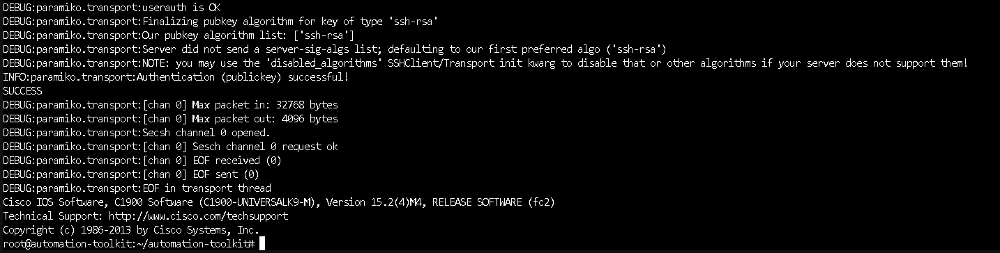
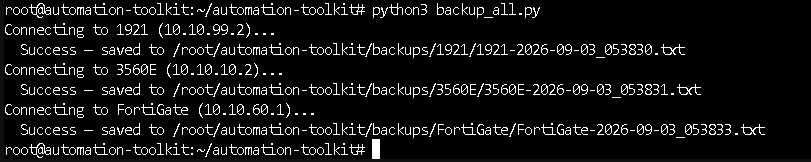
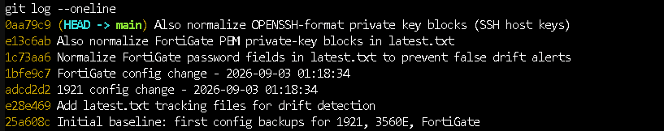
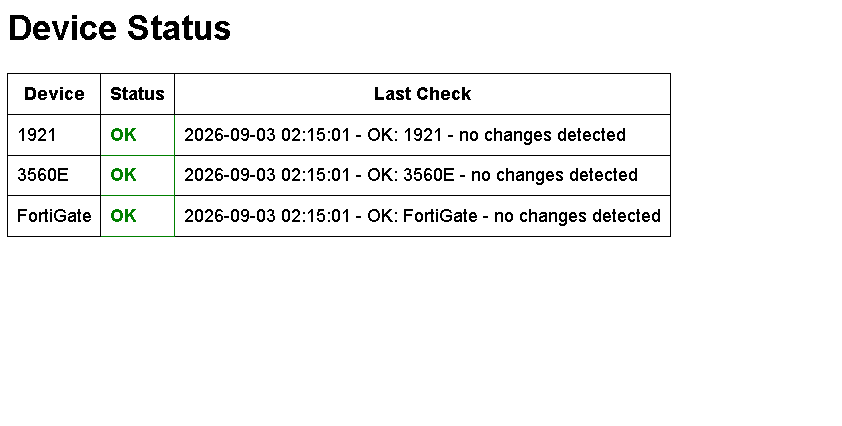
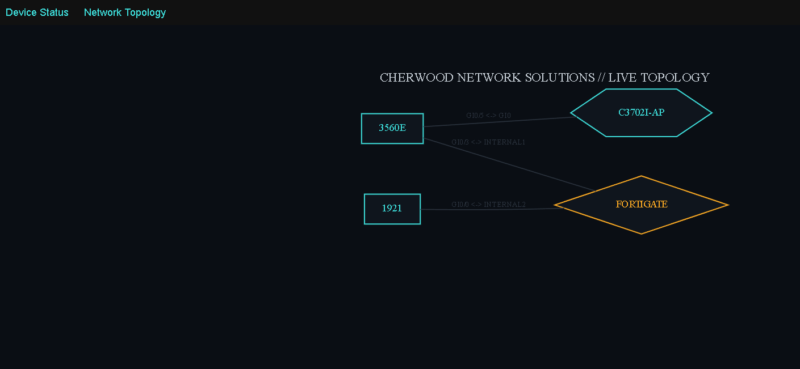
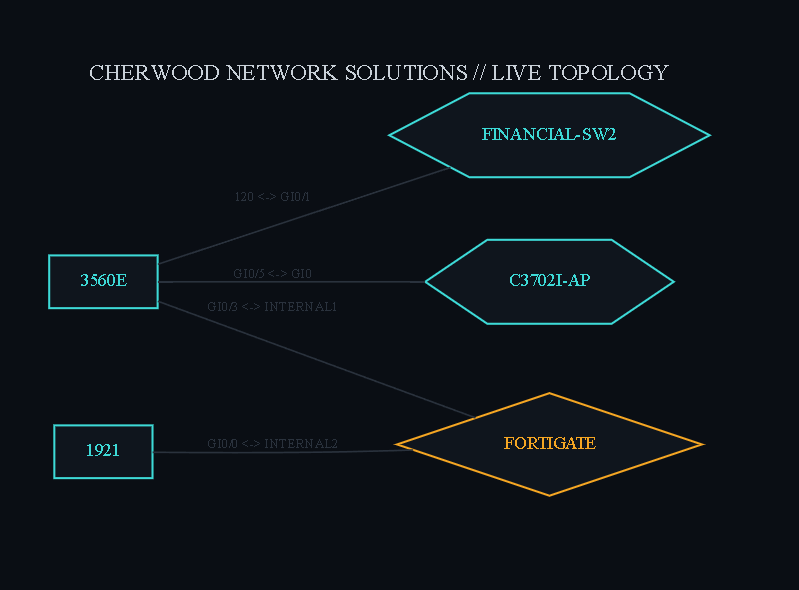
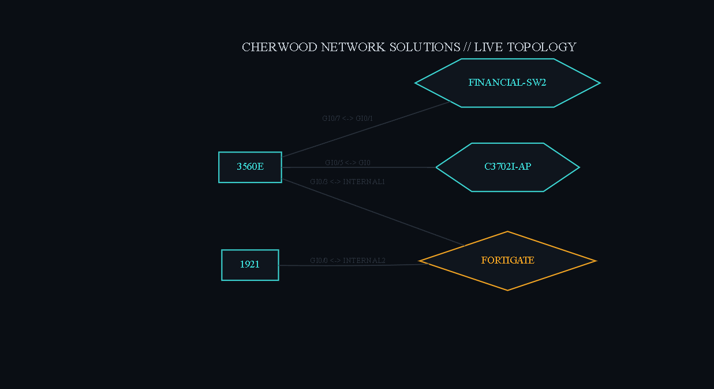
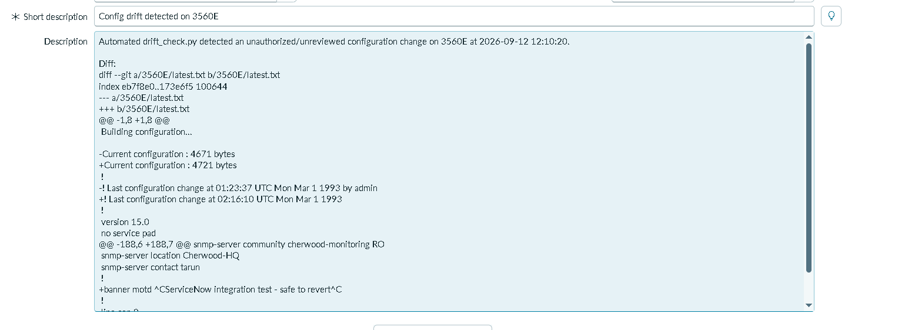

# Network Automation Toolkit

**Cherwood Network Solutions** — a real, unattended automation system that backs up, version-controls, and drift-checks the configuration of every core device across the Cherwood portfolio, running nightly with zero manual intervention.

Cherwood Network Solutions is Division 03 of the Cherwood Corporation portfolio, modeling how a small internal MSP would build, secure, and operate the tooling it uses to manage client infrastructure — starting with its first client, Cherwood Health, and now extended to Cherwood Financial and Cherwood Foundation.

> 🏗️ Architecture & design rationale: [`docs/ARCHITECTURE.md`](docs/ARCHITECTURE.md)
> 🐛 Real troubleshooting log (every bug, in full): [`docs/TROUBLESHOOTING-LOG.md`](docs/TROUBLESHOOTING-LOG.md)
> 🌐 Live project site: [networksolutions.tarunc.com](https://networksolutions.tarunc.com)
> 🔁 GitHub Pages mirror: [taruncherukurigit.github.io/network-automation-toolkit](https://taruncherukurigit.github.io/network-automation-toolkit/)
> 💼 Personal portfolio: [tarunc.com](https://tarunc.com)
> 📦 Related projects: [cherwood-health](https://github.com/taruncherukurigit/cherwood-health) · [hsrp-failover-lab](https://github.com/taruncherukurigit/hsrp-failover-lab) · [plainsboro-library-survey](https://github.com/taruncherukurigit/plainsboro-library-survey) · [activedirectory-cherwood](https://github.com/taruncherukurigit/activedirectory-cherwood)
> 🗺️ Automated Topology Discovery: [`docs/TOPOLOGY-DISCOVERY-README.md`](docs/TOPOLOGY-DISCOVERY-README.md)

---

## Why this project exists

Cherwood Health already had bash scripts doing nightly config backups. This project replaces that with something that actually scales, holds up to real scrutiny, and mirrors how a real MSP would build tooling for a client:

| | Old approach (Cherwood Health bash scripts) | This toolkit |
|---|---|---|
| Adding a new device | Write a new bash script | Add one entry to `inventory.py` |
| Version history | Single `latest.txt` diff | Full Git history — any two points in time, ever |
| Identity | Shared `admin` account for humans and scripts | Dedicated `svc-automation` service account, independently revocable |
| Failure visibility | Generic pass/fail | Per-device failure category (timeout / auth / unexpected) |
| Status check | SSH in and read a log | Web dashboard, one glance |

## What it actually does

Every night at 9:00 PM Eastern:

1. **Connects** to the FortiGate 60E, Cisco Catalyst 3560E, Cisco 1921 ISR, and Cisco Catalyst 3560E-24TD-S (the Cherwood Financial HA pair's spare switch) over SSH using a dedicated, narrowly-scoped service account — not a shared admin login
2. **Pulls** the full running configuration from each
3. **Saves** a timestamped permanent snapshot, plus a `latest.txt` pointer used for comparison
4. **Commits** every snapshot into a local Git repository — real, permanent, diffable history
5. **Compares** the new pull against the last known-good commit 15 minutes later, flagging anything that genuinely changed
6. **Displays** live pass/fail status for all four devices on an internal Flask dashboard
7. **Rediscovers** the live network topology via LLDP 15 minutes after that, and regenerates the visual diagram — so the map is never stale documentation someone forgot to update

Real config drift also opens a ServiceNow Incident automatically via the Table REST API, with severity mapped by scanning the diff for ACL/firewall/routing keywords — turning detection into an actual ticket a NOC would triage. Full writeup, verification, and a real Change Request walkthrough: [`docs/SERVICENOW-INTEGRATION.md`](docs/SERVICENOW-INTEGRATION.md).

No cloud service, no SaaS dependency, no manual step.

## Automated Topology Discovery

Extends the toolkit with a nightly pipeline that pulls live LLDP neighbor data from every device, normalizes it across two completely different vendor formats (Cisco IOS vs. FortiOS), and renders it as a diagram served on its own dashboard route — `/topology`.

Cisco and Fortinet expose LLDP through entirely different commands and output formats, and neither gives the complete picture in a single call: Cisco's detail output omits the local interface entirely (requiring a second command cross-referenced by port ID), and FortiGate uses a different command family altogether (`diagnose lldprx`, not `show`). Full writeup — including the exact bugs hit building this, like the same physical link showing up as two edges because each device reports its neighbor's name differently, and a fixed-width parsing bug found later when a new device's longer hostname broke the same column-based logic — is in [`docs/TOPOLOGY-DISCOVERY-README.md`](docs/TOPOLOGY-DISCOVERY-README.md).

**Live diagram:** [netmap.tarunc.com](https://netmap.tarunc.com)

## Architecture

```
                    [Cisco 3560E — Gi0/3, Gi0/6 & Gi0/7 trunks]
                                    │
                              [Proxmox / T14]
                                    │
                                [vmbr0]
                     ┌──────────────┼──────────────┐
                     │                              │
          other VLANs (30/40/70)          [automation-toolkit — VLAN 60]
          (Servers, DMZ, Financial)          10.10.60.10, isolated segment
                                                │
                            svc-automation (dedicated SSH identity)
                                                │
              ┌───────────────┬───────────┬─────┴──────────┐
        [Cisco 1921]     [Cisco 3560E]  [Financial-SW2]  [FortiGate 60E]
        10.10.99.2       10.10.10.2     10.10.10.3        10.10.60.1
                                        (key auth unsupported —
                                         password-based, per-device)
```

**Deliberately isolated on its own VLAN, not sharing a segment with general-purpose containers.** This is the one system in the entire portfolio with SSH credentials to *every* device in the network. Putting it on its own segment with narrow, explicit firewall policies (SSH+SNMP to specific management IPs only) means a compromise here doesn't cascade automatically into every other VLAN. Modeled directly on how a real MSP is scoped into a client's environment: least-privilege, not blanket trust.

**The dashboard is intentionally not internet-facing** — reachable only from the internal Trusted VLAN via an explicit policy, consistent with Cherwood Health's own minimal internet-exposure posture (SSL-VPN and one DMZ site, nothing else).

Full network design rationale: [Cherwood Health — Architecture](https://github.com/taruncherukurigit/cherwood-health/blob/main/docs/ARCHITECTURE.md)

## Stack

`Python 3.11` · `Netmiko` · `Paramiko` · `Git` · `Flask` · `Graphviz` · `cron` · Cisco IOS 15.2 / 12.2 · FortiOS 7.4 · ServiceNow Table REST API

## The real engineering story

### Bug #1: a 12-year-old, still-unresolved Paramiko/Cisco IOS incompatibility

Every connection attempt to the 1921 and 3560E failed with `Illegal info request from server`, immediately after the SSH key was accepted (`userauth is OK` in the debug log). Downgrading Paramiko didn't fix it. Changing SSH algorithm settings didn't fix it. Manual `ssh` with compatibility flags worked flawlessly, every time — proof the tooling was the problem, not the devices or the credentials.

Rather than route around it, I traced the failure with debug-level Paramiko logging and cross-referenced it against open GitHub issues going back to **2012** (`paramiko/paramiko#122`, `ktbyers/netmiko#904`, and others) — the exact same error, same log signature, unresolved for over a decade across every Paramiko version in between.

The real root cause, confirmed via protocol-level analysis in one of those threads: legacy Cisco IOS SSH servers don't strictly follow RFC 4252's public-key auth flow. Modern Paramiko sends the signed key proof immediately in one step (a valid shortcut per spec) — these IOS versions incorrectly respond as if only the unsigned "would you accept this key" probe was sent, asking for the signature a second time. Paramiko has no handler for that redundant request during public-key auth and throws a protocol error.

**Fix:** a targeted compatibility patch (`ios_compat_patch.py`) that caches the last signed public-key message and resends it verbatim if the device asks again — satisfying the device's redundant request instead of erroring out. Confirmed working via debug logs showing `Authentication (publickey) successful!` and a real `show version` executing over the connection.

### Bug #2: a false positive that would have run silently forever

Drift detection worked immediately and correctly for both Cisco devices — proven against a deliberately-introduced real change (an SNMP location string edit), which it correctly caught. The FortiGate, meanwhile, reported a "change" on *every single run*, including runs where nothing was touched at all.

Diffing two consecutive pulls of the exact same, unmodified FortiGate config confirmed the cause: FortiGate re-encrypts embedded password fields and private-key material with a fresh random salt on every single config pull, even with zero underlying change to the actual value.

Left unfixed, this would have buried every real alert in nightly noise from day one — the exact failure mode that erodes trust in a monitoring system until it gets ignored entirely, which defeats the purpose of building it in the first place.

**Fix:** a normalization pass that replaces randomized ciphertext (`ENC ...` fields, `ENCRYPTED PRIVATE KEY` blocks, `OPENSSH PRIVATE KEY` blocks) with a fixed placeholder *before* comparison — applied only to the file used for drift-checking, never to the permanent timestamped backup, which always retains the full real output. Verified by pulling the FortiGate twice in a row and confirming an empty diff.

### Bug #3: not every device in a "matching" fleet actually matches

Adding a second Cisco 3560E (the spare switch for the [HSRP failover lab](https://github.com/taruncherukurigit/hsrp-failover-lab)) should have been a one-line `inventory.py` addition, using the exact same key-based SSH pattern as every other Cisco device. It wasn't: `ip ssh pubkey-chain` returned `% Invalid input detected` on the new switch, even from confirmed global configuration mode.

`ip ssh ?` on the device confirmed the real cause — this specific switch's IOS train (12.2, versus the primary's newer image) never implemented key-based SSH authentication at all. Same vendor, same hardware family, genuinely different capability, invisible until an actual second unit of "the same" device type got added.

**Fix:** rather than force a single fleet-wide auth assumption, `inventory.py`'s existing per-device design was used as intended — each entry can independently specify `use_keys` and a fallback `password`. Netmiko's `ConnectHandler` already accepts either natively, so this required a one-line data change, zero code changes to `backup_all.py`, `drift_check.py`, or `topology.py`.

Both bugs are documented in full — including dead ends and things that didn't work — in [`docs/TROUBLESHOOTING-LOG.md`](docs/TROUBLESHOOTING-LOG.md).

## Screenshots

**Proof the SSH bug fix actually works** — debug-level Paramiko log showing successful public-key authentication and a real command executing on the 1921, immediately after applying `ios_compat_patch.py`.



**A real backup run** — all devices, connected via Netmiko, config pulled and saved.



**Git commit history** — real, permanent version control, not a single overwritten file.



**Live status dashboard** — internal Flask page, reachable only from the Trusted VLAN.



**Auto-generated network topology** — LLDP-discovered, rendered nightly via Graphviz, zero manual maintenance.



**Before/after: the hostname-overflow parsing bug (Bug #3)** — a 22-character hostname silently broke a fixed-width CLI parser, producing a nonsense port label (`120 <-> GI0/1`) instead of the real interface pairing. After renaming the device to fit the column width, the pipeline correctly re-resolved the link (`GI0/7 <-> GI0/1`).

| Broken | Fixed |
|---|---|
|  |  |

**ServiceNow Incident auto-created from real config drift** — detection alone isn't the job; a real network operation needs the change to become a tracked, triaged ticket. A banner change was made directly on the 3560E. On the next scheduled `drift_check.py` run, the diff was detected, the built-in severity mapping correctly classified it as Moderate (no ACL/firewall/routing keywords present), and the script automatically opened `INC0010002` in ServiceNow — with the full unified diff embedded directly in the Incident's Description field, not a generic "something changed" message.



The integration was also verified against a real, formal Change Request (`CHG0030001`), walked through ServiceNow's actual Normal Change approval workflow — New → Assess → Authorize → Scheduled → Implement → Review → Closed, including genuine CAB-style approver records — documenting the already-completed HSRP failover cutover test (3.33s measured failover, from the HA/Failover Lab) rather than a placeholder change. Full writeup, every screenshot, the exact API test, and the bugs hit building it: [`docs/SERVICENOW-INTEGRATION.md`](docs/SERVICENOW-INTEGRATION.md).

## Known limitations (stated honestly, not hidden)

- **Shared privilege level.** `svc-automation` runs at privilege 15 (Cisco) / `super_admin` (FortiGate) — a stated tradeoff, since neither platform has granular role-based CLI access configured in this lab. A production deployment would scope this down to read-only config access specifically.
- **Normalization hides which password field changed, not that a change occurred elsewhere.** The drift-check fix trades a small amount of specificity (you won't be told *which* encrypted field's value changed on the FortiGate) for eliminating false alarms entirely — the actual encrypted values are still fully captured in every permanent timestamped backup, unaffected by normalization.
- **No secrets manager.** SSH private keys and the one device's fallback password live on the automation container's filesystem, protected by VLAN isolation and firewall scope rather than a dedicated vault (HashiCorp Vault, etc.) — a reasonable simplification for a single-operator lab, a real gap in a multi-operator production environment.
- **Auth method isn't uniform across the fleet.** One device (the HSRP lab's spare switch) authenticates via password instead of key, purely due to its older IOS train — least-privilege is still enforced at the VLAN 60 firewall boundary, but not at the device credential layer for that one device. Documented explicitly rather than hidden.
- **Dual-stack reverse proxy configuration is easy to get half-right.** The public site itself shipped with a real bug on first deploy: the nginx server block only listened on IPv4 (`listen 80;`), while the Cloudflare Tunnel connecting to it could use either IPv4 or IPv6 loopback — meaning roughly half of all requests silently fell through to a *different* site on the same container instead of erroring out. Full root-cause writeup in [`docs/TROUBLESHOOTING-LOG.md`](docs/TROUBLESHOOTING-LOG.md#bug-4--site-silently-served-the-wrong-content-ipv6ipv4-loopback-mismatch).
- **ServiceNow severity mapping is keyword-based, not semantic.** `determine_urgency()` scans the diff text for a fixed list of substrings (`access-list`, `permit`, `deny`, `firewall`, `acl`, `ip route`) rather than structurally parsing the configuration change — a change that happens to mention one of these words in an unrelated context (e.g., a comment) would be misclassified. Full detail in [`docs/SERVICENOW-INTEGRATION.md`](docs/SERVICENOW-INTEGRATION.md#known-limitations).

## Repository structure

```
├── index.html                  # The project site (also served via GitHub Pages)
├── inventory.py                # Device list — add a device here, nowhere else
├── backup_all.py                # Connects, pulls config, saves + normalizes
├── drift_check.py               # Compares latest pull against last commit; now also opens a ServiceNow Incident on real drift
├── dashboard.py                  # Flask status page
├── ios_compat_patch.py          # The Paramiko/Cisco IOS compatibility fix
├── topology.py                   # LLDP pull from every device (Netmiko)
├── parse_topology.py             # Normalizes vendor formats into one edge list
├── render_topology.py            # Graphviz SVG rendering
├── docs/
│   ├── ARCHITECTURE.md
│   ├── TROUBLESHOOTING-LOG.md
│   ├── TOPOLOGY-DISCOVERY-README.md
│   ├── TOPOLOGY-TROUBLESHOOTING.md
│   └── SERVICENOW-INTEGRATION.md
└── configs/                      # Sanitized example device configs
```

## Related projects

- [**Cherwood Health**](https://github.com/taruncherukurigit/cherwood-health) — the 21-part segmented enterprise network this toolkit manages
- [**Cherwood Financial — HA/Failover Lab**](https://github.com/taruncherukurigit/hsrp-failover-lab) — the HSRP failover pair whose spare switch this toolkit now automates, and the source of Bug #3 above
- [**Cherwood Foundation — AD/802.1X/SSL-VPN**](https://github.com/taruncherukurigit/activedirectory-cherwood) — identity management delivered as a client engagement
- [**Packetgeist**](https://github.com/taruncherukurigit/plainsboro-library-survey) — wireless site survey, Cherwood Library division

---

*Division 03 of the Cherwood Corporation portfolio — built by Tarun Cherukuri alongside CCNA/CWNA study.*