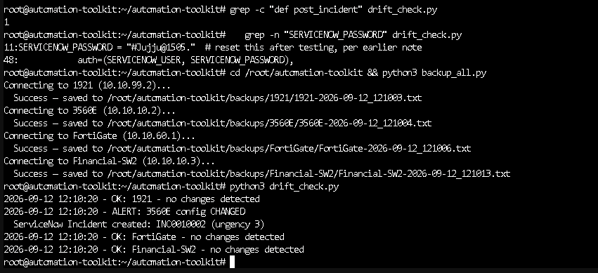
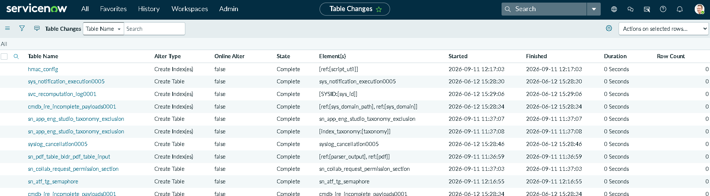
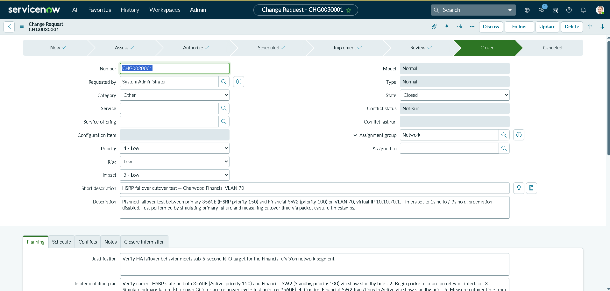

# ServiceNow Integration

Extends `drift_check.py` (part of the Network Automation Toolkit) to automatically
open a ServiceNow Incident whenever unauthorized/unreviewed configuration drift
is detected on a monitored device, and demonstrates the process side of network
operations via a formal Change Request for a real, already-completed change.

## Why this exists

Most portfolio projects in this space stop at "I built a network." Real network
engineer and NOC roles run on process as much as on config: an unauthorized
change gets caught, a ticket gets filed, someone triages it, and a planned
change goes through change control *before* it happens, not just after. This
toolkit already had the detection half (`drift_check.py`, running nightly since
Division 03 shipped). ServiceNow adds the process half, using the same ITSM
platform a real NOC would actually run on -- not a custom email or Slack alert,
but an Incident record in the same system a real operations team triages from.

The story this proves: **detection alone is not the job.** A tool that notices
a change and a tool that turns that change into a tracked, triaged, auditable
record are two different levels of maturity, and this integration is the
difference between them.

## Architecture

```
drift_check.py (runs nightly via cron, 21:15)
    |
    +-- git diff against last known-good config
    |
    +-- if drift detected:
    |     +-- log locally (existing behavior)
    |     +-- determine_urgency() -- keyword scan of the diff
    |     |     (access-list/permit/deny/firewall/acl/ip route -> High;
    |     |      else -> Moderate)
    |     +-- post_incident() -> POST to ServiceNow Table API
    |           -> auto-creates an Incident with the full diff attached
    |
    +-- git commit the new baseline (existing behavior)
```

## What was built

- **`post_incident()`** -- POSTs to the ServiceNow Incident Table REST API
  (`/api/now/table/incident`) whenever `drift_check.py`'s existing detection
  logic finds a real diff. Populates short description, device name, the full
  diff text, and a severity-mapped urgency/impact.
- **`determine_urgency()`** -- a keyword-based severity mapping. Config changes
  touching ACLs, firewall rules, or routing (`access-list`, `permit`, `deny`,
  `firewall`, `acl`, `ip route`) are flagged High urgency; everything else
  (e.g. a banner, an SNMP string) defaults to Moderate. This isn't a token
  gesture -- it was verified to actually discriminate, not just tag everything
  the same way (see Verification below).
- **A formal Change Request** (`CHG0030001`) documenting the HSRP failover
  cutover test from the HA/Failover Lab (Division 05) -- walked through the
  full ServiceNow Normal Change lifecycle: New -> Assess -> Authorize ->
  Scheduled -> Implement -> Review -> Closed, including real CAB-style
  approval gates, not a shortcut state jump.

## Walkthrough

**1. Proving the API itself works, before touching any production code.**
A manual `curl` POST against the Incident Table API, run directly, confirmed
the endpoint, auth, and payload shape before any of it got wired into
`drift_check.py`. This is deliberate -- isolating "does the API work" from
"did I break my working drift-check script" means a failure afterward has
exactly one place to look.



**2. A real config change, automatically becoming a real Incident.**
A banner change was made directly on the 3560E. On the next `drift_check.py`
run, the diff was picked up, `determine_urgency()` correctly classified it as
Moderate (a banner touches none of the High-severity keywords), and
`post_incident()` created `INC0010002` -- with the full unified diff embedded
directly in the Description field, not just a generic "something changed"
message.


**3. A real Change Request, run through the actual approval workflow.**
Rather than force the record's state field directly, the Change Request was
pushed through ServiceNow's real Normal Change model: `Request Approval`,
Assignment Group validation, and genuine CAB-style approver records that had
to be individually approved before the state would advance. This is what a
production change actually looks like -- and hitting (and solving) the "why
won't the state field just change" friction firsthand is a more credible story
than a change request that was never actually gated by anything.



**4. Closed out, referencing the real, already-verified result.**
The Change Request's close notes reference the actual measured outcome from
the HA/Failover Lab -- 3.33s failover time, confirmed via packet timestamp
analysis -- rather than a generic "completed successfully" placeholder.



## Verification performed

| Claim | Result | Evidence |
|---|---|---|
| Manual API POST creates a real Incident | Yes | `INC0010001` created via test `curl`, confirmed in UI |
| Real config drift triggers an automatic Incident | Yes | Banner change on 3560E -> `drift_check.py` detected it -> `INC0010002` auto-created with full diff in Description |
| Severity mapping discriminates by content | Yes | Banner change (no ACL/firewall keywords) correctly landed at default Moderate urgency, not High |
| Change Request lifecycle works end-to-end | Yes | `CHG0030001` walked through New -> Assess -> Authorize -> Scheduled -> Implement -> Review -> Closed, including real approval records |
| Credentials are not hardcoded | Yes | `SERVICENOW_PASSWORD` pulled from environment variable, set in crontab, not committed to git |

## Real bugs hit, and why they matter

### Bug -- Password briefly hardcoded during initial testing
**Problem:** During initial development, the ServiceNow instance password was
hardcoded directly in `drift_check.py` to get the integration working quickly.
**Diagnosis:** Caught before the file was committed to git -- hardcoded
credentials in a script that will eventually be pushed to a public repo is a
real, common mistake, not a hypothetical one.
**Fix:** Moved to `os.environ.get("SERVICENOW_PASSWORD", "")`, with the actual
value set once in root's crontab (since cron doesn't inherit `~/.bashrc`, a
plain shell-profile export wouldn't have been picked up by the scheduled job).
**Why it matters:** Catching a credential before it lands in git history is a
real operational habit -- once a secret is committed, it's in the repo's
history permanently unless the history itself is rewritten. This is the kind
of "caught it before it shipped" story that's more valuable than pretending
it never happened.

### Bug -- Approval workflow enforced fields not obvious from the form
**Problem:** Advancing the Change Request state via the State dropdown directly
was silently rejected by ServiceNow's Normal change model.
**Diagnosis:** The model requires Assignment Group to be set and requires going
through `Request Approval` rather than a direct state field edit -- this isn't
obvious from the form alone, and the first attempt to just change the dropdown
did nothing.
**Fix:** Used the `Request Approval` action, filled the required Assignment
Group field, and approved through the generated CAB-style approval records
rather than trying to force the state field.
**Why it matters:** Real ITSM change models gate state transitions behind
approval policies by design -- this is a feature, not a bug, and matches how
production change management actually behaves. Fighting the platform instead
of understanding its workflow would have produced a fake-looking result.

## Known limitations

- Severity mapping is a simple keyword string-match on the diff text, not a
  structural parse of the configuration change -- a real implementation would
  parse the diff semantically (e.g., via a config-parsing library) rather than
  scanning for substrings. A change that happens to mention one of these words
  in a comment, for instance, would be misclassified.
- Single shared `admin` credential for the ServiceNow API call, consistent with
  the rest of this toolkit's existing `svc-automation` pattern -- a production
  system would use a scoped integration user with least-privilege API access
  rather than a full admin account.
- The Change Request for the HSRP failover test was filed retroactively, after
  the actual test was performed (documented honestly with the real test date),
  rather than filed prospectively before the change -- in a real environment,
  the Change Request would precede the implementation, not follow it.

## Resume / LinkedIn framing

> Integrated automated network configuration-drift detection with ServiceNow
> via the Table REST API to auto-generate Incident tickets on unauthorized
> changes; documented a completed HSRP failover test through formal Change
> Management workflow (New -> Assess -> Authorize -> Scheduled -> Implement ->
> Review -> Closed).

## Related

- [Network Automation Toolkit](../README.md) -- parent project
- [HA/Failover Lab](https://github.com/taruncherukurigit/hsrp-failover-lab) -- source of the HSRP test referenced in the Change Request